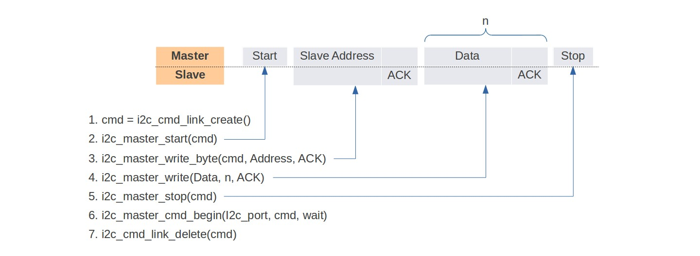
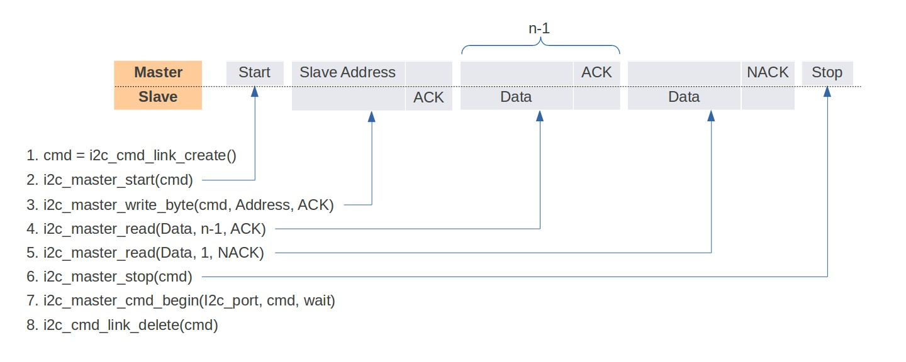

Test Case - Generation of Diagrams
==================================

Evaluation of `blockdiag - simple diagram images generator <http://blockdiag.com/en/index.html>`_

blockdiag examples
^^^^^^^^^^^^^^^^^^

http://blockdiag.com/en/blockdiag/index.html

blockdiag - example 1
"""""""""""""""""""""

**Current implementation with ASCII art**

::

    +--------+     +--------+     +--------+     +--------+
    | Page 1 |     | Page 2 |     | Page 3 |     | Page 4 |
    | Full   +---> | Full   +---> | Active |     | Empty  |   <- states
    | #11    |     | #12    |     | #14    |     |        |   <- sequence numbers
    +---+----+     +----+---+     +----+---+     +---+----+
        |               |              |             |
        |               |              |             |
        |               |              |             |
    +---v------+  +-----v----+  +------v---+  +------v---+
    | Sector 3 |  | Sector 0 |  | Sector 2 |  | Sector 1 |    <- physical sectors
    +----------+  +----------+  +----------+  +----------+

**New implementation**

.. blockdiag::

    blockdiag sector_to_pages_mapping {

        default_group_color = "#f2f2f2";
        span_width = 30;

        P1 [label = "Page 1\nFull\n#11", height=60, width=60];
        P2 [label = "Page 2\nFull\n#12", height=60, width=60];
        P3 [label = "Page 3\nActive\n#13", height=60, width=60];
        P4 [label = "Page 4\nEmpty\n#", height=60, width=60];
        PN [label = "<- page #\n<- states\n<- sequence #", height=60, width=160, shape=note, color=yellow];

        S3 [label = "Sector 3", width=80];
        S0 [label = "Sector 0", width=80];
        S2 [label = "Sector 2", width=80];
        S1 [label = "Sector 1", width=80];
        SN [label = "<- physical sectors", width=160, shape=note, color=yellow];

        P1 -> P2;
        P2 -> P3;
        P3 -> P4 [style = dashed];
        P4 -> PN [style = none];

        group {
           orientation = portrait
           P1 -> S3;
        }
        group {
           orientation = portrait
           P2 -> S0;
        }
        group {
           orientation = portrait
           P3 -> S2;
        }
        group {
           orientation = portrait
           P4 -> S1;
        }
        group {
           orientation = portrait
           PN -> SN [style = none];
        }
    }

**Code of the new implementation**

::

    blockdiag sector_to_pages_mapping {

        default_group_color = "#f2f2f2";
        span_width = 30;

        P1 [label = "Page 1\nFull\n#11", height=60, width=60];
        P2 [label = "Page 2\nFull\n#12", height=60, width=60];
        P3 [label = "Page 3\nActive\n#13", height=60, width=60];
        P4 [label = "Page 4\nEmpty\n#", height=60, width=60];
        PN [label = "<- page #\n<- states\n<- sequence #", height=60, width=160, shape=note, color=yellow];

        S3 [label = "Sector 3", width=80];
        S0 [label = "Sector 0", width=80];
        S2 [label = "Sector 2", width=80];
        S1 [label = "Sector 1", width=80];
        SN [label = "<- physical sectors", width=160, shape=note, color=yellow];

        P1 -> P2;
        P2 -> P3;
        P3 -> P4 [style = dashed];
        P4 -> PN [style = none];

        group {
           orientation = portrait
           P1 -> S3;
        }
        group {
           orientation = portrait
           P2 -> S0;
        }
        group {
           orientation = portrait
           P3 -> S2;
        }
        group {
           orientation = portrait
           P4 -> S1;
        }
        group {
           orientation = portrait
           PN -> SN [style = none];
        }
    }

blockdiag - example 2
"""""""""""""""""""""

**Current implementation with ASCII art**

::

                            default handler              user handler
   -----------               -------------               -------------
  |           |   event     |             | callback or |             |
  |   TCPIP   | --------->  |    event    | ----------> | application |
  |   stack   |             |     task    |  event      |    task     |
   -----------               -------------               -------------
                                  /|\                          |
                                   |                           |
                            event  |                           |
                                   |                           |
                                   |                           |
                              -------------                    |
                             |             |                   |
                             | Wi-Fi Driver|/__________________|
                             |             |\     API call
                             |             |
                              -------------

**New implementation**

.. blockdiag::

    blockdiag wifi_programming_model {

        # global attributes
        node_width = 120;
        node_height = 60;
        span_height = 60;
        span_width = 100;
        default_shape = roundedbox;
        default_group_color = none;

        # node labels
        TCP_STACK [label="TCP\n stack", fontsize=14];
        EVNT_TASK [label="event\n task", fontsize=14];
        APPL_TASK [label="application\n task", fontsize=14, width=130];
        WIFI_DRV  [label="Wi-Fi\n Driver", fontsize=14];
        KNOT [shape=none];

        # node connections + labels
        TCP_STACK -> EVNT_TASK [label=event];
        EVNT_TASK -> APPL_TASK [label="callback\n or event"];

        # arrange nodes vertically
        group {
           label = "default handler";
           orientation = portrait;
           EVNT_TASK <- WIFI_DRV [label=event];
        }

        # intermediate node
        group {
            label = "user handler";
            orientation = portrait;
            APPL_TASK -- KNOT;
        }
        WIFI_DRV <- KNOT [label="API\n call"];
    }

**Code of the new implementation**

::

    blockdiag wifi_programming_model {

        # global attributes
        node_width = 120;
        node_height = 60;
        span_height = 60;
        span_width = 100;
        default_shape = roundedbox;
        default_group_color = none;

        # node labels
        TCP_STACK [label="TCP\n stack", fontsize=14];
        EVNT_TASK [label="event\n task", fontsize=14];
        APPL_TASK [label="application\n task", fontsize=14, width=130];
        WIFI_DRV  [label="Wi-Fi\n Driver", fontsize=14];
        KNOT [shape=none];

        # node connections + labels
        TCP_STACK -> EVNT_TASK [label=event];
        EVNT_TASK -> APPL_TASK [label="callback\n or event"];

        # arrange nodes vertically
        group {
           label = "default handler";
           orientation = portrait;
           EVNT_TASK <- WIFI_DRV [label=event];
        }

        # intermediate node
        group {
            label = "user handler";
            orientation = portrait;
            APPL_TASK -- KNOT;
        }
        WIFI_DRV <- KNOT [label="API\n call"];
    }

Bring this code to the `interactive shell <http://interactive.blockdiag.com/?compression=deflate&src=eJyFk09P40AMxe98CqscIVILq72UIFX8kSoQWy0RHABFTuImFtOZaGYKuyC-O840bagaRI7Pfs7Pz0mmTP5cMJbwynNOa2tKi4sF6zJdmIIUvO_tgTz7UCqToQL03nK29OSCrqUpfeXCVxDD6Gg47tSKuKy8yL9b1dWov1E3E4atWtAcl8qnrsKapGDNUhdUZObfdr2UQp3mRhkrXdpoGq-BGwhQmJFaoSZns_Q2mZxdwUNQ44Eojxqcx_x5cAhzo73jN4pHv55WL7m4u0nSZHLbOeiFtBePR9dvmcxm19sWrGvFOXo2utd4CGH5eHQ8bGfcTy-n6fnfO9jMuOfoksV9bvmFbO-Lr27-JPAQ4oqbGJ62c8iN1pQ3EA4O-lOJTncXDvvupCGdu3vmqFQmSQqm3CIYBx0EWou6pADjQJbw3Bj-h3I4onxpsHrCQLnmoD0yVKgLJXuP1x3GsowPmUpfbay3yH5T7khPoi7NnpU-1nisPdkFyY_gV4x9XB3Y0pHdpfoJ60toURQOtqbYuvpJ1B6zDXYym0qmTVpNnh-fpWcbRA>`__ and try out some modifications. 

blockdiag - example 3
"""""""""""""""""""""

**Current implementation with ASCII art**

::

     -------------              -------------              -------------
    | Application |            |    LwIP     |            |    Wi-Fi    |
    |    task     | ---------> |    task     | ---------> |    task     |
     -------------              -------------              -------------
      1> User data               2> Pbuf                    3> Dynamic (Static) TX Buffer

**New implementation**

.. blockdiag::

    blockdiag buffer_allocation_tx {

        # global attributes
        node_width = 160; 
        node_height = 80;
        span_height = 10;
        span_width = 100;
        default_shape = roundedbox;
        default_fontsize = 16

        # labels of diagram nodes
        APPL_TASK [label="Application\n task"];  
        LwIP_TASK [label="LwIP\n task"];  
        WiFi_TASK [label="Wi-Fi\n task"];

        # labels of description nodes
        APPL_DESC [label="1> User data", fontsize=14, height=30, shape=note, color=yellow];  
        LwIP_DESC [label="2> Pbuf", fontsize=14, height=30, shape=note, color=yellow];  
        WiFi_DESC [label="3> Dynamic (Static) TX Buffer", fontsize=14, width=260, height=30, shape=note, color=yellow];

        # node connections
        APPL_TASK -> LwIP_TASK -> WiFi_TASK
        APPL_DESC -> LwIP_DESC -> WiFi_DESC [style=none]
    }

**Code of the new implementation**

::

    blockdiag buffer_allocation_tx {

        # global attributes
        node_width = 160; 
        node_height = 80;
        span_height = 10;
        span_width = 100;
        default_shape = roundedbox;
        default_fontsize = 16

        # labels of diagram nodes
        APPL_TASK [label="Application\n task"];  
        LwIP_TASK [label="LwIP\n task"];  
        WiFi_TASK [label="Wi-Fi\n task"];

        # labels of description nodes
        APPL_DESC [label="1> User data", fontsize=14, height=30, shape=note, color=yellow];  
        LwIP_DESC [label="2> Pbuf", fontsize=14, height=30, shape=note, color=yellow];  
        WiFi_DESC [label="3> Dynamic (Static) TX Buffer", fontsize=14, width=260, height=30, shape=note, color=yellow];

        # node connections
        APPL_TASK -> LwIP_TASK -> WiFi_TASK
        APPL_DESC -> LwIP_DESC -> WiFi_DESC [style=none]
    }

Bring this code to the `interactive shell <http://interactive.blockdiag.com/?compression=deflate&src=eJylUk1rwkAQvfsrBntpIUKiRQqSgK0VSj0EtCi0EjbJxCyuuyG7QW3pf-9m06hJeyg0t33zmHkfCZmItjElGwiLJME8IEwjRFHBA3WAj04H9HcFGyZCwoAoldOwUCgNzkWMwZ7GKgUXnKE9gjOcIt2kSuN39sigMiP8jDqX6GmF_Y3GmJCCqUCmJEM9yEXBY4xDcWjOE8GVpO9oztdaGQmRSRAJlMZysjOCKsVj358Fi_H8GV4Nze2Os4zRyvEbB0XktrseQWVktn_ym-wS-UFb0ilt0pa0N6Vn3i_KUEY5zcqrbXWTx_nDaZHjwYvEHGKiSNeC2q_r3FpQZekObAtMTi4XCi2IBBO5e0Rd5L7ppLG574GvO__PUuO7sXTgweTIyY5GcD1XOtToBhYruDf_VvuUad3tD-0_Xq1TLPPSI84xKvNrF9vzLnrTj1M7rYhrXv24cCPVkZUaOK47n1-lOvbk>`__ and try out some modifications. 

blockdiag - example 4
"""""""""""""""""""""

**Current implementation**

**New implementation**

.. blockdiag::

    blockdiag i2c-command-link-master-write { 
        # global properties
        span_width = 5;
        span_height = 5;
        node_height = 25;
        default_group_color = lightgrey;
        class spacer [shape=none, width=10];
        class cmdlink [colwidth=2, width=180];
        class cjoint [shape=none, width=40];

        # all the rows
        0 -- a0 --                         f0 [style=none]; 
        1 -- a1 -- b1 -- c1 -- d1 -- e1 -- f1 -- g1 -- h1 [style=none]; 
        2 -- a2 -- b2 -- c2 -- d2 -- e2 -- f2 -- g2 [style=none]; 
        3 -- a3 --             d3 --       f3 [style=none];
        4 -- a4 [style=none];
        5 -- a5 [style=none];
        6 -- a6 --       c6 [style=none];
        7 -- a7 --       c7 -- d7 [style=none];
        8 -- a8 --       c8 --              f8 [style=none];
        9 -- a9 --       c9 --                         h9 [style=none];
        10 -- a10 [style=none];
        11 -- a11 [style=none];

        # separator row
        3, a3, d3, f3 [shape=none, height=5];

        # tuning node properties and connections
        0 [class=spacer]; a0 [shape=none, colwidth=5]; f0 [shape=note, colwidth=2];
        1 [class=spacer]; a1 [shape=none]; b1; c1 [width=40]; e1 [shape=none, width=30]; g1 [shape=none, width=30]; h1 [width=40];
        2 [class=spacer]; a2 [shape=none]; b2; c2 [class=cjoint]; d2 [shape=none]; e2 [width=30]; f2 [shape=none]; g2 [width=30];
        3 [class=spacer]; a3 [shape=none, colwidth=3]; d3 [colwidth=2]; f3 [colwidth=2];
        4 [class=spacer]; a4 [class=cmdlink]
        5 [class=spacer]; a5 [class=cmdlink];
        6 [class=spacer]; a6 [class=cmdlink]; c6 [class=cjoint]; a6 -- c6 [style=solid]; c6 -- c2 -> c1 [folded];
        7 [class=spacer]; a7 [class=cmdlink]; c7 [class=cjoint]; d7 [shape=none, colwidth=2]; a7 -- c7 -- d7 [style=solid]; d7 -> d3 [folded];
        8 [class=spacer]; a8 [class=cmdlink]; c8 [class=cjoint, colwidth=3]; f8 [shape=none, colwidth=2]; a8 -- c8 -- f8 [style=solid]; f8 -> f3 [folded];
        9 [class=spacer]; a9 [class=cmdlink]; c9 [class=cjoint, colwidth=5]; h9 [shape=none, width=40]; a9 -- c9 -- h9 [style=solid]; h9 -> h1 [folded];
        10 [class=spacer]; a10 [class=cmdlink]; 
        11 [class=spacer]; a11 [class=cmdlink]; 

        # labels
        f0 [label="Data n times", shape=note, color=yellow];
        b1 [label=Master, shape=note, color=lightyellow]; c1 [label=START]; d1 [label="Slave Address"]; f1 [label=Data]; h1 [label=STOP];
        b2 [label=Slave, shape=note, color=lightyellow]; e2 [label=ACK]; g2 [label=ACK];  
        a4 [shape=note, label=Commands, color=yellow]; 
        a5 [label="cmd = i2c_cmd_link_create()", numbered = 1]; 
        a6 [label="i2c_master_start(cmd)", numbered = 2]; 
        a7 [label="i2c_master_write_byte(cmd, Address, ACK)", numbered = 3]; 
        a8 [label="i2c_master_write(Data, n, ACK)", numbered = 4]; 
        a9 [label="i2c_master_stop(cmd)", numbered = 5]; 
        a10 [label="i2c_master_cmd_begin(I2c_port, cmd, wait)", numbered = 6]; 
        a11 [label="i2c_cmd_link_delete(cmd)", numbered = 7]; 

        # Slave Address
        group { d1; e1; }
        group { d2; e2; d3; }

        # Data x n times
        group { f1; g1;}
        group { f2; g2; f3; }
    }

**Code of the new implementation**

::

    blockdiag i2c-command-link-master-write { 
        # global properties
        span_width = 5;
        span_height = 5;
        node_height = 25;
        default_group_color = lightgrey;
        class spacer [shape=none, width=10];
        class cmdlink [colwidth=2, width=180];
        class cjoint [shape=none, width=40];

        # all the rows
        0 -- a0 --                         f0 [style=none]; 
        1 -- a1 -- b1 -- c1 -- d1 -- e1 -- f1 -- g1 -- h1 [style=none]; 
        2 -- a2 -- b2 -- c2 -- d2 -- e2 -- f2 -- g2 [style=none]; 
        3 -- a3 --             d3 --       f3 [style=none];
        4 -- a4 [style=none];
        5 -- a5 [style=none];
        6 -- a6 --       c6 [style=none];
        7 -- a7 --       c7 -- d7 [style=none];
        8 -- a8 --       c8 --              f8 [style=none];
        9 -- a9 --       c9 --                         h9 [style=none];
        10 -- a10 [style=none];
        11 -- a11 [style=none];

        # separator row
        3, a3, d3, f3 [shape=none, height=5];

        # tuning node properties and connections
        0 [class=spacer]; a0 [shape=none, colwidth=5]; f0 [shape=note, colwidth=2];
        1 [class=spacer]; a1 [shape=none]; b1; c1 [width=40]; e1 [shape=none, width=30]; g1 [shape=none, width=30]; h1 [width=30];
        2 [class=spacer]; a2 [shape=none]; b2; c2 [class=cjoint]; d2 [shape=none]; e2 [width=30]; f2 [shape=none]; g2 [width=30];
        3 [class=spacer]; a3 [shape=none, colwidth=3]; d3 [colwidth=2]; f3 [colwidth=2];
        4 [class=spacer]; a4 [class=cmdlink]
        5 [class=spacer]; a5 [class=cmdlink];
        6 [class=spacer]; a6 [class=cmdlink]; c6 [class=cjoint]; a6 -- c6 [style=solid]; c6 -- c2 -> c1 [folded];
        7 [class=spacer]; a7 [class=cmdlink]; c7 [class=cjoint]; d7 [shape=none, colwidth=2]; a7 -- c7 -- d7 [style=solid]; d7 -> d3 [folded];
        8 [class=spacer]; a8 [class=cmdlink]; c8 [class=cjoint, colwidth=3]; f8 [shape=none, colwidth=2]; a8 -- c8 -- f8 [style=solid]; f8 -> f3 [folded];
        9 [class=spacer]; a9 [class=cmdlink]; c9 [class=cjoint, colwidth=5]; h9 [shape=none, width=30]; a9 -- c9 -- h9 [style=solid]; h9 -> h1 [folded];
        10 [class=spacer]; a10 [class=cmdlink]; 
        11 [class=spacer]; a11 [class=cmdlink]; 

        # labels
        f0 [label="Data n times", shape=note, color=yellow];
        b1 [label=Master, shape=note, color=lightyellow]; c1 [label=START]; d1 [label="Slave Address"]; f1 [label=Data]; h1 [label=STOP];
        b2 [label=Slave, shape=note, color=lightyellow]; e2 [label=ACK]; g2 [label=ACK];  
        a4 [shape=note, label=Commands, color=yellow]; 
        a5 [label="cmd = i2c_cmd_link_create()", numbered = 1]; 
        a6 [label="i2c_master_start(cmd)", numbered = 2]; 
        a7 [label="i2c_master_write_byte(cmd, Address, ACK)", numbered = 3]; 
        a8 [label="i2c_master_write(Data, n, ACK)", numbered = 4]; 
        a9 [label="i2c_master_stop(cmd)", numbered = 5]; 
        a10 [label="i2c_master_cmd_begin(I2c_port, cmd, wait)", numbered = 6]; 
        a11 [label="i2c_cmd_link_delete(cmd)", numbered = 7]; 

        # Slave Address
        group { d1; e1; }
        group { d2; e2; d3; }

        # Data x n times
        group { f1; g1;}
        group { f2; g2; f3; }
    }

blockdiag - example 5
"""""""""""""""""""""

**Current implementation**

**New implementation**

.. blockdiag::
    :width: 1000

    blockdiag i2c-command-link-master-read { 
        # global properties
        span_width = 5;
        span_height = 5;
        node_height = 25;
        default_group_color = lightgrey;
        class spacer [shape=none, width=10];
        class cmdlink [colwidth=2, width=180];
        class cjoint [shape=none, width=40];

        # all the rows
        0 -- a0 --                         f0 [style=none]; 
        1 -- a1 -- b1 -- c1 -- d1 -- e1 -- f1 -- g1 -- h1 -- i1 -- j1 [style=none]; 
        2 -- a2 -- b2 -- c2 -- d2 -- e2 -- f2 -- g2 -- h2 -- i2  [style=none]; 
        3 -- a3 --             d3 --       f3 --       h3 [style=none];
        4 -- a4 [style=none];
        5 -- a5 [style=none];
        6 -- a6 --       c6 [style=none];
        7 -- a7 --       c7 -- d7 [style=none];
        8 -- a8 --       c8 --              f8 [style=none];
        9 -- a9 --       c9 --                         h9 [style=none];
        10 -- a10 --     c10 --                                    j10 [style=none];
        11 -- a11 [style=none];
        12 -- a12 [style=none];

        # separator row
        3, a3, d3, f3, h3 [shape=none, height=5];

        # tuning node properties and connections
        0 [class=spacer]; a0 [shape=none, colwidth=5]; f0 [shape=note, colwidth=2];
        1 [class=spacer]; a1 [shape=none]; b1; c1 [width=40]; e1 [shape=none, width=30]; f1 [shape=none]; g1 [width=30]; h1 [shape=none]; i1 [width=30]; j1 [width=40];
        2 [class=spacer]; a2 [shape=none]; b2; c2 [class=cjoint]; d2 [shape=none]; e2 [width=30]; g2 [shape=none, width=30]; i2 [shape=none, width=30];
        3 [class=spacer]; a3 [shape=none, colwidth=3]; d3 [colwidth=2]; f3 [colwidth=2]; h3 [colwidth=2];
        4 [class=spacer]; a4 [class=cmdlink]
        5 [class=spacer]; a5 [class=cmdlink];
        6 [class=spacer]; a6 [class=cmdlink]; c6 [class=cjoint]; a6 -- c6 [style=solid]; c6 -- c2 -> c1 [folded];
        7 [class=spacer]; a7 [class=cmdlink]; c7 [class=cjoint]; d7 [shape=none, colwidth=2]; a7 -- c7 -- d7 [style=solid]; d7 -> d3 [folded];
        8 [class=spacer]; a8 [class=cmdlink]; c8 [class=cjoint, colwidth=3]; f8 [shape=none, colwidth=2]; a8 -- c8 -- f8 [style=solid]; f8 -> f3 [folded];
        9 [class=spacer]; a9 [class=cmdlink]; c9 [class=cjoint, colwidth=5]; h9 [shape=none, colwidth=2]; a9 -- c9 -- h9 [style=solid]; h9 -> h3 [folded];
        10 [class=spacer]; a10 [class=cmdlink]; c10 [class=cjoint, colwidth=7]; j10 [shape=none, width=40]; a10 -- c10 -- j10 [style=solid]; j10 -> j1 [folded];
        11 [class=spacer]; a11 [class=cmdlink]; 
        12 [class=spacer]; a12 [class=cmdlink]; 

        # labels
        f0 [label="Data (n-1) times", shape=note, color=yellow];
        b1 [label=Master, shape=note, color=lightyellow]; c1 [label=START]; d1 [label="Slave Address"]; g1 [label=ACK]; i1 [label=NACK]; j1 [label=STOP];
        b2 [label=Slave, shape=note, color=lightyellow]; e2 [label=ACK]; f2 [label=Data]; h2 [label=Data];
        a4 [shape=note, label=Commands, color=yellow]; 
        a5 [label="cmd = i2c_cmd_link_create()", numbered = 1]; 
        a6 [label="i2c_master_start(cmd)", numbered = 2]; 
        a7 [label="i2c_master_write_byte(cmd, Address, ACK)", numbered = 3]; 
        a8 [label="i2c_master_read(Data, n-1, ACK)", numbered = 4]; 
        a9 [label="i2c_master_read(Data, 1, NACK)", numbered = 5]; 
        a10 [label="i2c_master_stop(cmd)", numbered = 6]; 
        a11 [label="i2c_master_cmd_begin(I2c_port, cmd, wait)", numbered = 7]; 
        a12 [label="i2c_cmd_link_delete(cmd)", numbered = 8]; 

        # Slave Address
        group { d1; e1; }
        group { d2; e2; d3; }

        # Data x (n - 1) times
        group { f1; g1;}
        group { f2; g2; f3; }

        # Data
        group { h1; i1; }
        group { h2; i2; h3; }
    }

**Code of the new implementation**

::

    blockdiag i2c-command-link-master-read { 
        # global properties
        span_width = 5;
        span_height = 5;
        node_height = 25;
        default_group_color = lightgrey;
        class spacer [shape=none, width=10];
        class cmdlink [colwidth=2, width=180];
        class cjoint [shape=none, width=40];

        # all the rows
        0 -- a0 --                         f0 [style=none]; 
        1 -- a1 -- b1 -- c1 -- d1 -- e1 -- f1 -- g1 -- h1 -- i1 -- j1 [style=none]; 
        2 -- a2 -- b2 -- c2 -- d2 -- e2 -- f2 -- g2 -- h2 -- i2  [style=none]; 
        3 -- a3 --             d3 --       f3 --       h3 [style=none];
        4 -- a4 [style=none];
        5 -- a5 [style=none];
        6 -- a6 --       c6 [style=none];
        7 -- a7 --       c7 -- d7 [style=none];
        8 -- a8 --       c8 --              f8 [style=none];
        9 -- a9 --       c9 --                         h9 [style=none];
        10 -- a10 --     c10 --                                    j10 [style=none];
        11 -- a11 [style=none];
        12 -- a12 [style=none];

        # separator row
        3, a3, d3, f3, h3 [shape=none, height=5];

        # tuning node properties and connections
        0 [class=spacer]; a0 [shape=none, colwidth=5]; f0 [shape=note, colwidth=2];
        1 [class=spacer]; a1 [shape=none]; b1; c1 [width=40]; e1 [shape=none, width=30]; f1 [shape=none]; g1 [width=30]; h1 [shape=none]; i1 [width=30]; j1 [width=40];
        2 [class=spacer]; a2 [shape=none]; b2; c2 [class=cjoint]; d2 [shape=none]; e2 [width=30]; g2 [shape=none, width=30]; i2 [shape=none, width=30];
        3 [class=spacer]; a3 [shape=none, colwidth=3]; d3 [colwidth=2]; f3 [colwidth=2]; h3 [colwidth=2];
        4 [class=spacer]; a4 [class=cmdlink]
        5 [class=spacer]; a5 [class=cmdlink];
        6 [class=spacer]; a6 [class=cmdlink]; c6 [class=cjoint]; a6 -- c6 [style=solid]; c6 -- c2 -> c1 [folded];
        7 [class=spacer]; a7 [class=cmdlink]; c7 [class=cjoint]; d7 [shape=none, colwidth=2]; a7 -- c7 -- d7 [style=solid]; d7 -> d3 [folded];
        8 [class=spacer]; a8 [class=cmdlink]; c8 [class=cjoint, colwidth=3]; f8 [shape=none, colwidth=2]; a8 -- c8 -- f8 [style=solid]; f8 -> f3 [folded];
        9 [class=spacer]; a9 [class=cmdlink]; c9 [class=cjoint, colwidth=5]; h9 [shape=none, colwidth=2]; a9 -- c9 -- h9 [style=solid]; h9 -> h3 [folded];
        10 [class=spacer]; a10 [class=cmdlink]; c10 [class=cjoint, colwidth=7]; j10 [shape=none, width=40]; a10 -- c10 -- j10 [style=solid]; j10 -> j1 [folded];
        11 [class=spacer]; a11 [class=cmdlink]; 
        12 [class=spacer]; a12 [class=cmdlink]; 

        # labels
        f0 [label="Data (n-1) times", shape=note, color=yellow];
        b1 [label=Master, shape=note, color=lightyellow]; c1 [label=START]; d1 [label="Slave Address"]; g1 [label=ACK]; i1 [label=NACK]; j1 [label=STOP];
        b2 [label=Slave, shape=note, color=lightyellow]; e2 [label=ACK]; f2 [label=Data]; h2 [label=Data];
        a4 [shape=note, label=Commands, color=yellow]; 
        a5 [label="cmd = i2c_cmd_link_create()", numbered = 1]; 
        a6 [label="i2c_master_start(cmd)", numbered = 2]; 
        a7 [label="i2c_master_write_byte(cmd, Address, ACK)", numbered = 3]; 
        a8 [label="i2c_master_read(Data, n-1, ACK)", numbered = 4]; 
        a9 [label="i2c_master_read(Data, 1, NACK)", numbered = 5]; 
        a10 [label="i2c_master_stop(cmd)", numbered = 6]; 
        a11 [label="i2c_master_cmd_begin(I2c_port, cmd, wait)", numbered = 7]; 
        a12 [label="i2c_cmd_link_delete(cmd)", numbered = 8]; 

        # Slave Address
        group { d1; e1; }
        group { d2; e2; d3; }

        # Data x (n - 1) times
        group { f1; g1;}
        group { f2; g2; f3; }

        # Data
        group { h1; i1; }
        group { h2; i2; h3; }
    }

packetdiag example
^^^^^^^^^^^^^^^^^^

http://blockdiag.com/en/nwdiag/packetdiag-examples.html

**Current implementation with ASCII art**

::

    +-----------+--------------+-------------+-----------+
    | State (4) | Seq. no. (4) | Unused (20) | CRC32 (4) | Header (32)
    +-----------+--------------+-------------+-----------+
    |                Entry state bitmap (32)             |
    +----------------------------------------------------+
    |                       Entry 0 (32)                 |
    +----------------------------------------------------+
    |                       Entry 1 (32)                 |
    +----------------------------------------------------+
    /                                                    /
    /                                                    /
    +----------------------------------------------------+
    |                       Entry 125 (32)               |
    +----------------------------------------------------+

**New implementation**

.. packetdiag::

    packetdiag nvs_page_structure {
        colwidth = 32  
        node_width = 15
        node_height = 32
        default_fontsize = 12

        0-3: State\n(4)
        4-7: Seq. no.\n(4)
        8-27: Unused (20)
        28-31: CRC32\n(4)
        32-63: Entry state bitmap (32)  
        64-95: Entry 0 (32)
        96-127: Entry 1 (32)
        128-191: --- [colheight = 2]
        192-223: Entry 125 (32)
    }

**Code of the new implementation**

::

    packetdiag nvs_page_structure {
        colwidth = 32  
        node_width = 15
        node_height = 32
        default_fontsize = 12

        0-3: State\n(4)
        4-7: Seq. no.\n(4)
        8-27: Unused (20)
        28-31: CRC32\n(4)
        32-63: Entry state bitmap (32)  
        64-95: Entry 0 (32)
        96-127: Entry 1 (32)
        128-191: --- [colheight=2]
        192-223: Entry 125 (32)
    }

Bring this code to the `interactive shell <http://interactive.blockdiag.com/packetdiag/?compression=deflate&src=eJxFkMFOwzAQRO_9ij2mh63idRKaSj1V_ACIE6DIxG4StTgh3oCg6r_j2JTs8c3szNqDqk-GdacasJ-uGlRjKsfjVPM0GriswE_dn786zS3sQRJAYLbXprpRkS-sNV3TcrAGqM1RTWeujr1l1_2Y2U6rIKUod_DIis2LTbJ1YBneeWY-Nj5ts-AtkudPdnJGQ0JppLRFKXZweDhIWrySsPDB95bHb3BzPLx1_K4GSCSt_-4vMizzmykNSuBlgWKuioJYBOHLROnbEBGe_ZfEh-7pNcolIdF_raA8rl5_AaqqWyE>`__ and try out some modifications. 

seqdiag example
^^^^^^^^^^^^^^^

http://blockdiag.com/en/seqdiag/index.html

**Current implementation with ASCII art**

::

    ---------           ---------           --------- 
   |  app    |         |  event  |         |   Wi-Fi |
   |  task   |         |   task  |         |   task  |
    ---------           ---------           --------- 
        |                   |                   |
        |                   |                   |
        |      1.1> Configure country code      |
        |-------------------------------------->|
        |      1.2> Scan configuration          |
        |-------------------------------------->|
        |                   |                   |
        |                   |                   |
        |                   |                   |----
        |                   |                   |    | 2.1> Scan channel 1
        |                   |                   |<---
        |                   |                   |----
        |                   |                   |    | 2.2> Scan channel 2
        |                   |                   |<---
        |                   |                   |
        |                   |                   |      ....  ...
        |                   |                   |
        |                   |                   |----
        |                   |                   |    | 2.x> Scan channel N
        |                   |                   |<---
        |                   |                   |
        |           3.1 SYSTEM_EVENT_SCAN_DONE  |
        |                   |<------------------|
        |  3.2 SYSTEM_EVENT_SCAN_DONE           |
        |<------------------|                   |
        |                   |                   |

**New implementation**

.. seqdiag::

    seqdiag scan_for_spec_ap {
        activation = none;
        edge_length = 160;
        span_height = 15;
        default_shape = roundedbox;
        default_fontsize = 12; 

        app_task; event_task; Wi-Fi_task; 

        app_task   -> Wi-Fi_task [label="1.1 > Configure country code"];
        app_task   -> Wi-Fi_task [label="1.2 > Scan configuration"];
        Wi-Fi_task -> Wi-Fi_task [label="2.1 > Scan channel 1"];
        Wi-Fi_task -> Wi-Fi_task [label="2.2 > Scan channel 2"];
        Wi-Fi_task -> Wi-Fi_task [label="..."];
        Wi-Fi_task -> Wi-Fi_task [label="2.N > Scan channel N"];
        event_task <- Wi-Fi_task [label="3.1 > SYSTEM_EVENT_SCAN_DONE"];
        app_task <- event_task [label="3.2 > SYSTEM_EVENT_SCAN_DONE"];
    }

**Code of the new implementation**

::

    seqdiag scan_for_spec_ap {
        activation = none;
        edge_length = 160;
        span_height = 15;
        default_shape = roundedbox;
        default_fontsize = 12; 

        app_task; event_task; Wi-Fi_task; 

        app_task   -> Wi-Fi_task [label="1.1 > Configure country code"];
        app_task   -> Wi-Fi_task [label="1.2 > Scan configuration"];
        Wi-Fi_task -> Wi-Fi_task [label="2.1 > Scan channel 1"];
        Wi-Fi_task -> Wi-Fi_task [label="2.2 > Scan channel 2"];
        Wi-Fi_task -> Wi-Fi_task [label="..."];
        Wi-Fi_task -> Wi-Fi_task [label="2.N > Scan channel N"];
        event_task <- Wi-Fi_task [label="3.1 > SYSTEM_EVENT_SCAN_DONE"];
        app_task <- event_task [label="3.2 > SYSTEM_EVENT_SCAN_DONE"];
    }

Bring this code to the `interactive shell <http://interactive.blockdiag.com/seqdiag/?compression=deflate&src=eJyVkU1PwzAMhu_7FdburUgQXMomTaPcKIdOIIRQlDVuG1EloUknPsR_J2s2rRsT2nKJ9drvY8ex-C4kr8AWXLFSt8waLBg38D0Cf3jh5Io7qRVMQGmFSS-jqJA1qCpXe51cXwTZGg-pUVa1W8tXQRVY8q5xzNbcoNdb3SmBYqk_9vOlVs7Kr3UJoQmMwgDGMMftWwK4QuU28ZOM7uQm3q_zYTQd5OGl4UtsJmMSE5jCXKtSVl2LUPgpXPvpb4Hj1-RUCPWQ3O_K-wKpX84WMLAcB9B-igCouVLYADnDTA_N9GRzHMdnNMoOG2Vb8-4b4CY6Zr4MT3zOF-k9Sx_TbMHy-Sxjtw9Z-mfRHjEA7hD0X8TPLxU91AQ>`__ and try out some modifications. 